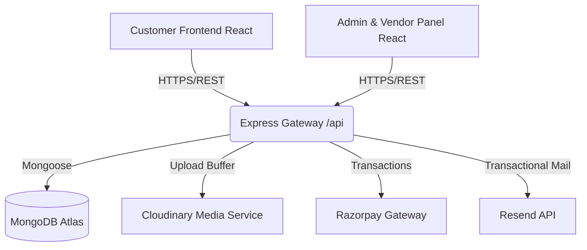

# CraveArc — Multi-Tenant Food Delivery & Restaurant Aggregator Platform

[](https://vite.dev/)
[](https://react.dev/)
[](https://nodejs.org/)
[](https://expressjs.com/)
[](https://www.mongodb.com/)
[](https://razorpay.com/)

CraveArc is a complete, multi-tenant food delivery and restaurant aggregator platform designed for modern food commerce. It supports customer ordering, automated payment processing, real-time administrative oversight, multi-tenant vendor operations, and fully automated financial settlements.

---

## Live Demo

*   **Customer Web Application**: [https://cravearc.vercel.app](https://cravearc.vercel.app)
*   **Admin & Vendor Dashboard**: [https://cravearc-admin.vercel.app](https://cravearc-admin.vercel.app)
*   **Backend REST API**: [https://cravearc-backend.onrender.com](https://cravearc-backend.onrender.com)

---

## System Architecture Overview



CraveArc is organized as a unified monorepo comprising three standalone workspaces:
1.  **`/backend`**: Node.js & Express REST API, implementing robust security middlewares, rate-limiters, sanitization routines, database services (Cloudinary, Resend, Razorpay), and Mongoose models.
2.  **`/frontend`** (Customer App): Responsive customer React SPA built on Vite, supporting cart operations, checkout flows, order history tracking, and active order notifications.
3.  **`/admin`** (Admin & Vendor Portal): Consolidated dashboard workspace enabling:
    *   **Platform Administrators** to moderate catalog listings, configure fee variables, and trigger financial settlement cycles.
    *   **Restaurant Vendor Partners** to manage catalogs, adjust restaurant profiles, view ledger balances, and process settlements.

---

## Complete Feature List

### 1. Customer Features
*   **Authentication & Verification**: Token-based sign-in with JWT, email validation triggers, and password reset flows.
*   **Discovery**: Real-time menus, category browsing, restaurant directory search, and cuisine matching.
*   **Favorites & Cart Management**: Instant addition of items, persistency, and a responsive shopping cart checkout page.
*   **Secure Payment Integration**: Razorpay checkout modal with cryptographic transaction verification.
*   **Order History**: Live tracking of orders (Pending, Placed, In Transit, Delivered, Cancelled) and notification logs.

### 2. Vendor Partner Features
*   **Vendor Registration**: Self-serve signup pipeline requiring Platform Admin approval before activation.
*   **Restaurant Profiling**: Customize operating hours, addresses, contact details, restaurant logo, and cover banners.
*   **Catalog Management**: Add, edit, or delete food items with custom tags, cooking parameters (veg/non-veg), preparation time, calories, and description.
*   **Finance & Wallet**: Real-time wallet balance, payout tracking, transactional ledger entries, and automated bank settlements.

### 3. Platform Admin Features
*   **Administrative Dashboard**: Unified telemetry overview showing gross revenue, platform commission cut, active user count, and vendor numbers.
*   **Catalog Moderation**: Approve or reject category request tickets sent by vendor partners.
*   **Store Governance**: Manage user states (suspend/activate), approve new vendor signups, and edit master sliders/banner promotions.
*   **Settlements & Payouts**: Automated calculation of vendor payouts, gate fees, commission splits, ledger audits, and payment releases.

### 4. Finance & Settlement Architecture
*   **Wallet System**: Active ledger ledger entries dynamically processing order credits, settlement debits, and partial refunds.
*   **Double-Entry Bookkeeping**: Core transactions write to both the Settlement records and the Global Ledger, verifying that debits and credits balance.
*   **Commission Structure**: Calculates gateway fees (2% + taxes) and custom platform commission splits dynamically during payment capture.

---

## Tech Stack

| Domain | Technology / Library |
| :--- | :--- |
| **Frontend Frame** | React (v19), Vite, React Router DOM (v7), Framer Motion |
| **Styling Engine** | Vanilla CSS, Tailwind CSS |
| **Notifications** | React Hot Toast |
| **Backend Engine** | Node.js, Express (v5) |
| **Database** | MongoDB (via Mongoose ODM) |
| **Payments** | Razorpay SDK |
| **Media Storage** | Cloudinary (via Multer Buffer Stream) |
| **Email Dispatcher** | Resend API |
| **Security Headers** | Helmet |
| **Rate Limiter** | Express Rate Limit |

---

## Folder Structure

```
cravearc-workspace/
├── backend/                  # REST API Server
│   ├── config/               # Database and API clients (Mongoose, Cloudinary, Razorpay, Resend)
│   ├── controllers/          # Business logic handlers (20+ modules)
│   ├── middlewares/          # Security gates (Auth, Sanitize, Validation)
│   ├── models/               # MongoDB Mongoose Schemas
│   ├── routes/               # API route mapping declarations
│   ├── services/             # Operations (Finance, Payouts, Email)
│   └── server.js             # Main server entrypoint
│
├── frontend/                 # Customer Web App (React + Vite)
│   ├── src/
│   │   ├── components/       # Visual components (Navbar, Footer, Modals)
│   │   ├── context/          # State management (StoreContext)
│   │   ├── lib/              # Centralized Axios client (axios.js)
│   │   └── Pages/            # View pages (Home, Cart, Checkout)
│   └── package.json
│
└── admin/                    # Admin & Vendor Portal (React + Vite)
    ├── src/
    │   ├── components/       # Layouts and widgets (NotificationCenter)
    │   ├── context/          # Administrative state (AdminContext)
    │   ├── lib/              # Centralized Axios client (axios.js)
    │   └── pages/            # View pages (List, Add, Finance)
    └── package.json
```

---

## Installation & Local Development

### 1. Clone the Repository
```bash
git clone https://github.com/pradhumansolanki14/cravearc.git
cd cravearc
```

### 2. Backend Setup
1.  Navigate to the `/backend` directory:
    ```bash
    cd backend
    ```
2.  Install dependencies:
    ```bash
    npm install
    ```
3.  Create a `.env` file from the blueprinted example:
    ```bash
    cp .env.example .env
    ```
    Configure MongoDB connection, JWT keys, Cloudinary credentials, Resend key, and Razorpay API tokens.
4.  Run database seeds (optional, populates default settings/admin data):
    ```bash
    node scripts/seed.js
    ```
5.  Start backend server in development mode:
    ```bash
    npm run dev
    ```

### 3. Frontend Setup (Customer App)
1.  Navigate to the `/frontend` directory:
    ```bash
    cd ../frontend
    ```
2.  Install dependencies:
    ```bash
    npm install
    ```
3.  Create a `.env` file:
    ```bash
    cp .env.example .env
    ```
4.  Start client development server:
    ```bash
    npm run dev
    ```

### 4. Admin Setup (Dashboard)
1.  Navigate to the `/admin` directory:
    ```bash
    cd ../admin
    ```
2.  Install dependencies:
    ```bash
    npm install
    ```
3.  Create a `.env` file:
    ```bash
    cp .env.example .env
    ```
4.  Start admin portal development server:
    ```bash
    npm run dev
    ```

---

## Environment Variables

### Backend (`/backend/.env`)
```ini
JWT_SECRET=your_jwt_signature_secret_key
MONGODB_URI=your_mongodb_atlas_connection_string
ADMIN_SECRET_KEY=your_admin_registration_guard_key

# Platform Admin seed variables
PLATFORM_ADMIN_EMAIL=admin.super1@cravearc.com
PLATFORM_ADMIN_PASSWORD=your_strong_admin_password
PLATFORM_ADMIN_NAME=Platform Administrator

# Media
CLOUDINARY_CLOUD_NAME=your_cloudinary_cloud_name
CLOUDINARY_API_KEY=your_cloudinary_api_key
CLOUDINARY_API_SECRET=your_cloudinary_api_secret

# Email
RESEND_API_KEY=your_resend_api_key

# Payments
RAZORPAY_KEY_ID=your_razorpay_key_id
RAZORPAY_KEY_SECRET=your_razorpay_key_secret
RAZORPAY_WEBHOOK_SECRET=your_webhook_validation_secret

# Frontend URLs
FRONTEND_URL=http://localhost:5173
```

### Frontend / Admin Client (`.env`)
```ini
VITE_CUSTOMER_APP=http://localhost:5173
VITE_VENDOR_APP=http://localhost:5174
VITE_API_URL=http://localhost:4000
```

---

## Security Implementation

*   **JWT Session Authentication**: Standardized JSON Web Tokens manage authorization lifecycles. Admin tokens check for direct administrative permissions.
*   **Helmet Headers**: Mounts strict Content Security Policies (CSP), frame guards, and X-XSS protection headers to block XSS and hijack vectors.
*   **Express Rate Limiting**: Mounted on API endpoints to prevent request flooding.
*   **NoSQL Injection Sanitization**: Strips operator syntax (such as `$gt`, `$ne`, etc.) from incoming HTTP inputs.
*   **ObjectId Validator Middleware**: Intercepts requests containing IDs, parsing them via mongoose object validator to prevent casting crash errors.
*   **Role-Based Access Control (RBAC)**: Route middleware explicitly checks role hierarchy constraints (`superadmin` vs. `vendor` vs. `customer`).

---

## Deployment Guide

### 1. Backend (Render)
*   Deploy using the Node runtime web service type.
*   Bind the listening port to `process.env.PORT` dynamically.
*   Insert production secrets securely under the Render Environment Panel.

### 2. Frontend & Admin clients (Vercel / Netlify)
*   Deploy as static Vite single-page-applications.
*   Inject the appropriate production variables (`VITE_API_URL` pointing to the deployed backend).

---

## Screenshots

*   *Customer Landing & Menu Grid*
    *(Insert Screenshot Mock)*
*   *Interactive Vendor Settlements & Wallet Overview*
    *(Insert Screenshot Mock)*
*   *Platform Administrative Moderation Interface*
    *(Insert Screenshot Mock)*

---

## Future Roadmap

- [ ] **Native Mobile Application**: Build React Native wrappers for iOS and Android customer clients.
- [ ] **SMS Integration**: Trigger SMS notifications on order updates using Twilio.
- [ ] **Advanced Delivery Dispatch**: Integrate Google Maps API to track driver positions.

---

## License & Author

*   **Author**: [Pradhuman Solanki](https://github.com/pradhumansolanki14)
*   **License**: Licensed under the ISC License.
